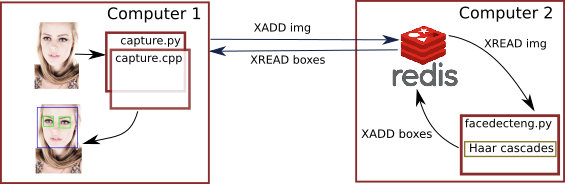

# RedisFaceDetection

How to use redis to run remotely a haar face detector
This demo implements a producer/consumer pattern to distribute an image processing algorithm in a remote computer.
A script reads an image that is shared with face detection script by means of a Radis database.
The following picture describes a two computers architecture; naturaly, all the modules could also run in the same
computer or in three different computers.

<p class="aligncenter">
    
</p>

<p style="font-size: 0.9rem;font-style: italic;">The model image has been redimensioned. A modified version presents the boxes correspoding to Haar Cascades face and eyes detections results. The modified images keep the same licence as determined by the original licence. <a href="https://www.flickr.com/photos/11357416@N06/4660014155">"FF_15"</a><span> by <a href="https://www.flickr.com/photos/11357416@N06">Rodrigo Favero</a></span> is licensed under <a href="https://creativecommons.org/licenses/by-nc-sa/2.0/?ref=ccsearch&atype=html" style="margin-right: 5px;">CC BY-NC-SA 2.0  </a><a href="https://creativecommons.org/licenses/by-nc-sa/2.0/?ref=ccsearch&atype=html" target="_blank" rel="noopener noreferrer" style="display: inline-block;white-space: none;margin-top: 2px;margin-left: 3px;height: 22px !important;"></a></p>

## How to use (local)

The Redis database can be run opening a terminal and using the provide docker-compose file:

```bash
$ docker-compose up
```
In other terminals you can run the detection script:

```bash
$ python3 facedecteng.py
```
and the capture script:

```bash
$ python3 capture.py
```

## How to use (distributed)

The same as in local but taking care of setting the correct paths for the Redis database.
